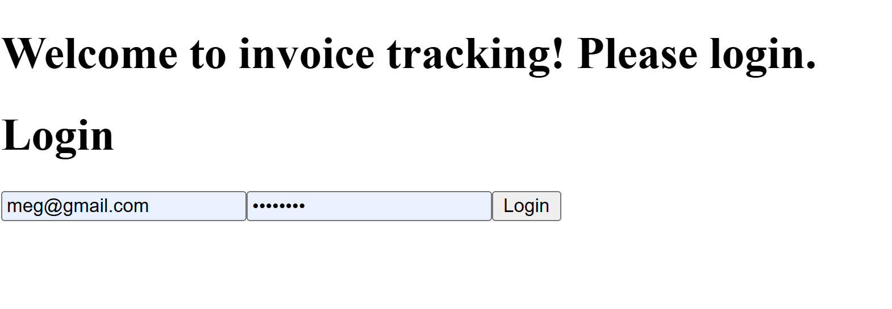

# Invoice Application 
  

       
   
   
   
   
   
   
   
   
  
  ## Description  ✏️
  
  An application that will allow a user to login and view invoices. Clicking on an invoice brings up a modal with the invoice details. The user can email the user directly from the modal. 

  This application uses NestJS for server, PostgreSQL and Prisma for the database and ORM respectively, React for the client, React Router Dom for the routing with createBrowserRouter, Zod for client side data verification (login page only), RTK for the client state management and React Query for the server state management on the client side (caching) with axios for fetching. The authentication is JWT Bearer tokens. Docker is used to run the app and provides an image for the database. Swagger is used for API documentation. FakerJS provides fake invoice data and fake users to associate with the invoices.

  The development version of the app uses vite to avoid CORS issues and otherwise make development fast and easy. The production discards the vite dev server and serves static assets via Nest's useStaticAssets feature. It finds the dist folder in the client volume. 

  ***FOR EASE OF USE ONLY*** <br/>
 
  Code for bcrypt is implemented but commented out.

  The database credentials as well as all environment variables are exposed in the compose.yml. If I have time I will hide them, but it's not very important at this time.

This application is for a showcase of skills only. This is not a real application.

  
  ## Table of Contents 📖
  
  [Installation](#installation)

  [Usage](#usage)

  

  [Issues](#known-issues)

  [Contributing](#how-to-contribute)

  [Tests](#tests) 

  [Questions](#questions)
  
  ## Installation 
  This project must be cloned to a computer with a docker engine. Once you clone, run "docker compose up" on the command line. This will install, build and run the application as well as set up the database and seed the database with random data generated by fakerjs.
  
  ```
 docker compose up
  ```

  Please be patient when you see > nest start --host 0.0.0.0 as it takes a moment to start the server. Await the confirmation in green that Nest application successfully started, and it may take a few moments beyond this. 
  
  ## Usage 
  Using your browser, visit
  ```
  localhost:3001
  ```
  
 The login is:
  user@example.com
  password123

  You may visit
  ```
 localhost:3001/api/docs
  ```
to interact with the api via Swagger documentation. Click the Authorize button and provide a JWT token from the login endpoint to interact with protected routes. Otherwise, example data is provided for ease of understanding.

If you take down the compose and want to bring it back up, please comment out or uniquely change the one user in the seed.ts file on server with the above credentials or you will get a prisma error and won't be able to bring the app back up. Just find the "FIXME" in server/prisma-service/seed.ts

## Deployed Link
  Not deployed

## Screenshots



______________________________________________________________________________________


## Known Issues 
Currently depending on the pagination limit set in the InvoiceList component and the number of invoices, you might get a blank page before the next button disables. 

Currently no way to jump to a page.

Considerations: Offset pagination does not scale well. I am assuming that the number of invoices won't be so high that this would be an issue but if it did become very high, this would have to be changed.

## How To Contribute 
  
No contributions at this time please.
  
## Tests 
  
To run tests, cd server and run the following command:
  
  ```
  npm test
  ```
*Tests are currently failing but app works appropriately. No focus given to tests at this time. In a real application I would have tests implemented with a CircleCI or github actions pipeline to lint and test prior to deploy to staging, then production. 

 ## Questions 
  
 If you have any questions about the repo or notice any bugs you want to report, open an issue or contact me directly at megan.meyers.388@gmail.com. 
  
  